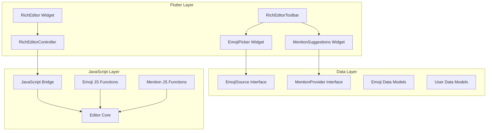

# Emoji Picker and Mention User Feature Implementation Plan

## Overview
This document outlines the architecture and implementation plan for adding customizable emoji picker and mention user features to the mb_rich_editor library. The design focuses on generic, adaptable components that can work with a wide range of use cases.

## Architecture Goals
1. **Generic & Adaptable**: Support multiple emoji sources (Unicode, custom images, etc.) and mention formats
2. **Customizable UI**: Allow developers to provide custom UI components for both emoji picker and mention suggestions
3. **Extensible**: Easy to add new emoji sources, mention data providers, and UI variations
4. **Type-Safe**: Leverage Dart's type system for better developer experience
5. **Performance**: Efficient rendering and search for large emoji/user datasets

## System Architecture



## 1. Core Data Models and Interfaces

### 1.1 Emoji Models

```dart
/// Represents a single emoji
class Emoji {
  final String id;
  final String name;
  final String? shortcodes;
  final String? unicode;
  final String? imageUrl;
  final String category;
  final List<String>? keywords;
  final Map<String, dynamic>? metadata;
}

/// Represents an emoji category
class EmojiCategory {
  final String id;
  final String name;
  final IconData? icon;
  final List<Emoji> emojis;
}

/// Configuration for emoji display
class EmojiDisplayConfig {
  final double size;
  final bool showShortcodes;
  final bool showTooltip;
  final EdgeInsets padding;
  final BoxDecoration decoration;
}
```

### 1.2 Emoji Source Interface

```dart
/// Abstract interface for emoji data sources
abstract class EmojiSource {
  /// Load all emojis
  Future<List<EmojiCategory>> loadCategories();
  
  /// Search emojis by query
  Future<List<Emoji>> searchEmojis(String query);
  
  /// Get emoji by shortcode
  Emoji? getEmojiByShortcode(String shortcode);
  
  /// Source metadata
  EmojiSourceMetadata get metadata;
}

/// Metadata about an emoji source
class EmojiSourceMetadata {
  final String name;
  final String version;
  final bool isUnicode;
  final int totalEmojis;
  final int totalCategories;
}
```

### 1.3 Mention Models

```dart
/// Represents a user that can be mentioned
class MentionUser {
  final String id;
  final String username;
  final String? displayName;
  final String? avatarUrl;
  final String? role;
  final Map<String, dynamic>? metadata;
}

/// Represents a mention inserted in the editor
class Mention {
  final MentionUser user;
  final String trigger; // e.g., '@'
  final MentionFormat format;
  final Map<String, dynamic>? attributes;
}

/// Format for rendering mentions
enum MentionFormat {
  text,           // @username
  link,           // <a href="...">@username</a>
  customHtml,     // Custom HTML template
  customWidget,   // Custom Flutter widget
}
```

### 1.4 Mention Provider Interface

```dart
/// Abstract interface for mention data providers
abstract class MentionProvider {
  /// Search users by query
  Future<List<MentionUser>> searchUsers(String query);
  
  /// Get user by ID
  Future<MentionUser?> getUserById(String id);
  
  /// Provider metadata
  MentionProviderMetadata get metadata;
}

/// Metadata about a mention provider
class MentionProviderMetadata {
  final String name;
  final String trigger; // e.g., '@'
  final int maxResults;
  final bool caseSensitive;
}
```

## 2. Emoji Picker Infrastructure

### 2.1 Emoji Picker Widget

```dart
/// Customizable emoji picker widget
class EmojiPicker extends StatefulWidget {
  final EmojiSource emojiSource;
  final EmojiPickerConfig config;
  final EmojiPickerStyle style;
  final ValueChanged<Emoji>? onEmojiSelected;
  final Widget Function(BuildContext, EmojiCategory)? categoryBuilder;
  final Widget Function(BuildContext, Emoji)? emojiBuilder;
}

/// Configuration for emoji picker behavior
class EmojiPickerConfig {
  final int columns;
  final int rows;
  final bool showSearch;
  final bool showCategories;
  final bool showFrequentlyUsed;
  final List<String>? favoriteEmojis;
  final Duration searchDebounce;
}

/// Styling for emoji picker
class EmojiPickerStyle {
  final Color backgroundColor;
  final Color categoryColor;
  final Color searchColor;
  final double emojiSize;
  final double categoryIconSize;
  final BoxDecoration decoration;
  final EdgeInsets padding;
}
```

### 2.2 Built-in Emoji Sources

```dart
/// Unicode emoji source (uses system fonts)
class UnicodeEmojiSource implements EmojiSource { ... }

/// JSON-based emoji source (like the existing voz emoji)
class JsonEmojiSource implements EmojiSource { ... }

/// Remote emoji source (fetches from API)
class RemoteEmojiSource implements EmojiSource { ... }

/// Custom emoji source (user-provided)
class CustomEmojiSource implements EmojiSource { ... }
```

### 2.3 Emoji Picker UI Variants

```dart
/// Grid-based emoji picker
class GridEmojiPicker extends EmojiPicker { ... }

/// List-based emoji picker
class ListEmojiPicker extends EmojiPicker { ... }

/// Compact emoji picker (for mobile)
class CompactEmojiPicker extends EmojiPicker { ... }

/// Full-featured emoji picker with search and categories
class FullEmojiPicker extends EmojiPicker { ... }
```

## 3. Mention User Infrastructure

### 3.1 Mention Suggestions Widget

```dart
/// Widget that shows mention suggestions
class MentionSuggestions extends StatefulWidget {
  final MentionProvider mentionProvider;
  final MentionSuggestionsConfig config;
  final MentionSuggestionsStyle style;
  final ValueChanged<MentionUser>? onUserSelected;
  final Widget Function(BuildContext, MentionUser)? userBuilder;
}

/// Configuration for mention suggestions
class MentionSuggestionsConfig {
  final int maxResults;
  final bool showAvatar;
  final bool showRole;
  final bool showMetadata;
  final Duration searchDebounce;
  final String? emptyStateMessage;
}

/// Styling for mention suggestions
class MentionSuggestionsStyle {
  final Color backgroundColor;
  final Color highlightColor;
  final Color textColor;
  final double avatarSize;
  final BoxDecoration decoration;
  final EdgeInsets padding;
}
```

### 3.2 Built-in Mention Providers

```dart
/// Static list of users
class StaticMentionProvider implements MentionProvider { ... }

/// API-based mention provider
class ApiMentionProvider implements MentionProvider { ... }

/// Firestore-based mention provider
class FirestoreMentionProvider implements MentionProvider { ... }

/// Custom mention provider
class CustomMentionProvider implements MentionProvider { ... }
```

### 3.3 Mention Trigger Detection

```dart
/// Configuration for mention triggers
class MentionTriggerConfig {
  final String trigger; // e.g., '@'
  final int minLength; // minimum chars before showing suggestions
  final bool requireSpaceBefore;
  final bool allowMultiple;
}

/// Manages mention trigger detection
class MentionTriggerManager {
  final List<MentionTriggerConfig> triggers;
  final ValueChanged<MentionTriggerEvent>? onTrigger;
}

/// Event when a mention trigger is detected
class MentionTriggerEvent {
  final String trigger;
  final String query;
  final int position;
  final TextRange range;
}
```

## 4. JavaScript Integration Layer

### 4.1 Emoji JavaScript Functions

```javascript
// Insert emoji at cursor position
RE.insertEmoji = function(emojiData) {
  const html = emojiToHtml(emojiData);
  RE.insertHTML(html);
  RE.callback();
}

// Convert emoji data to HTML
function emojiToHtml(emoji) {
  if (emoji.unicode) {
    return emoji.unicode;
  } else if (emoji.imageUrl) {
    return ``;
  }
  return '';
}

// Find and replace emoji shortcodes
RE.replaceEmojiShortcodes = function(emojiMap) {
  // Implementation for replacing :shortcode: with emoji
}

// Get emoji at cursor position
RE.getEmojiAtCursor = function() {
  // Implementation to get emoji under cursor
}
```

### 4.2 Mention JavaScript Functions

```javascript
// Insert mention at cursor position
RE.insertMention = function(mentionData) {
  const html = mentionToHtml(mentionData);
  RE.insertHTML(html);
  RE.callback();
}

// Convert mention data to HTML
function mentionToHtml(mention) {
  switch (mention.format) {
    case 'text':
      return `${mention.trigger}${mention.user.username}`;
    case 'link':
      return `<a href="/users/${mention.user.id}" class="mention" data-user-id="${mention.user.id}">${mention.trigger}${mention.user.username}</a>`;
    case 'customHtml':
      return mention.customTemplate(mention);
    default:
      return `${mention.trigger}${mention.user.username}`;
  }
}

// Detect mention trigger in text
RE.detectMentionTrigger = function(text, position, trigger) {
  // Implementation to detect @ symbol and get query
}

// Get mention at cursor position
RE.getMentionAtCursor = function() {
  // Implementation to get mention under cursor
}

// Replace mention text with formatted mention
RE.replaceMentionText = function(range, mentionData) {
  // Implementation to replace @username with formatted mention
}
```

### 4.3 JavaScript Channel Registration

```dart
// In RichEditor widget
..addJavaScriptChannel(
  'onEmojiSelected',
  onMessageReceived: (JavaScriptMessage message) {
    final emoji = Emoji.fromJson(jsonDecode(message.message));
    widget.controller.onEmojiSelected?.call(emoji);
  },
)
..addJavaScriptChannel(
  'onMentionTrigger',
  onMessageReceived: (JavaScriptMessage message) {
    final event = MentionTriggerEvent.fromJson(jsonDecode(message.message));
    widget.controller.onMentionTrigger?.call(event);
  },
)
```

## 5. Controller Extensions

### 5.1 Emoji Methods in RichEditorController

```dart
/// Insert emoji at cursor position
Future<void> insertEmoji(Emoji emoji) async {
  final emojiJson = jsonEncode(emoji.toJson());
  await _evalJs('RE.insertEmoji($emojiJson);');
}

/// Replace emoji shortcodes in current content
Future<void> replaceEmojiShortcodes(Map<String, Emoji> emojiMap) async {
  final emojiMapJson = jsonEncode(emojiMap.map((k, v) => MapEntry(k, v.toJson())));
  await _evalJs('RE.replaceEmojiShortcodes($emojiMapJson);');
}

/// Get emoji at cursor position
Future<Emoji?> getEmojiAtCursor() async {
  await _evalJs('window.getEmojiAtCursor.postMessage(RE.getEmojiAtCursor());');
  // Wait for callback
  await Future.delayed(const Duration(milliseconds: 100));
  return _currentEmoji;
}

/// Callback when emoji is selected from picker
ValueChanged<Emoji>? onEmojiSelected;
```

### 5.2 Mention Methods in RichEditorController

```dart
/// Insert mention at cursor position
Future<void> insertMention(Mention mention) async {
  final mentionJson = jsonEncode(mention.toJson());
  await _evalJs('RE.insertMention($mentionJson);');
}

/// Get mention at cursor position
Future<Mention?> getMentionAtCursor() async {
  await _evalJs('window.getMentionAtCursor.postMessage(RE.getMentionAtCursor());');
  // Wait for callback
  await Future.delayed(const Duration(milliseconds: 100));
  return _currentMention;
}

/// Get all mentions in the editor
Future<List<Mention>> getAllMentions() async {
  // Implementation to parse HTML and extract mentions
}

/// Replace mention text with formatted mention
Future<void> replaceMentionText(TextRange range, Mention mention) async {
  final mentionJson = jsonEncode(mention.toJson());
  await _evalJs('RE.replaceMentionText(${range.start}, ${range.end}, $mentionJson);');
}

/// Callback when mention trigger is detected
ValueChanged<MentionTriggerEvent>? onMentionTrigger;

/// Callback when mention is selected
ValueChanged<MentionUser>? onMentionSelected;
```

## 6. Toolbar Integration

### 6.1 Emoji Picker Button

```dart
/// Toolbar button for opening emoji picker
class EmojiPickerButton extends StatelessWidget {
  final EmojiSource emojiSource;
  final EmojiPickerConfig config;
  final EmojiPickerStyle? style;
  final ValueChanged<Emoji>? onEmojiSelected;
}

// Add to ToolbarButtonDefinition
static const emojiPicker = ToolbarButtonDefinition(
  id: 'emojiPicker',
  icon: Icons.emoji_emotions,
  label: 'Emoji',
);
```

### 6.2 Mention Button (Optional)

```dart
/// Toolbar button for manual mention insertion
class MentionButton extends StatelessWidget {
  final MentionProvider mentionProvider;
  final MentionSuggestionsConfig config;
  final MentionSuggestionsStyle? style;
  final ValueChanged<MentionUser>? onUserSelected;
}

// Add to ToolbarButtonDefinition
static const mention = ToolbarButtonDefinition(
  id: 'mention',
  icon: Icons.alternate_email,
  label: 'Mention',
);
```

### 6.3 Integration with RichEditorToolbar

```dart
// In RichEditorToolbar widget
final EmojiSource? emojiSource;
final MentionProvider? mentionProvider;
final EmojiPickerConfig? emojiConfig;
final MentionSuggestionsConfig? mentionConfig;

// In _RichEditorToolbarState
Widget _buildButton(ToolbarButtonDefinition buttonDef) {
  switch (buttonDef.id) {
    case 'emojiPicker':
      return EmojiPickerButton(
        emojiSource: widget.emojiSource!,
        config: widget.emojiConfig ?? EmojiPickerConfig.defaultConfig,
        onEmojiSelected: (emoji) => widget.controller.insertEmoji(emoji),
      );
    case 'mention':
      return MentionButton(
        mentionProvider: widget.mentionProvider!,
        config: widget.mentionConfig ?? MentionSuggestionsConfig.defaultConfig,
        onUserSelected: (user) => widget.controller.insertMention(
          Mention(user: user, trigger: '@', format: MentionFormat.link),
        ),
      );
    // ... existing cases
  }
}
```

## 7. RichEditor Widget Extensions

### 7.1 New Properties

```dart
class RichEditor extends StatefulWidget {
  // ... existing properties
  
  /// Emoji source for emoji picker
  final EmojiSource? emojiSource;
  
  /// Emoji picker configuration
  final EmojiPickerConfig? emojiConfig;
  
  /// Mention provider for user mentions
  final MentionProvider? mentionProvider;
  
  /// Mention configuration
  final MentionConfig? mentionConfig;
  
  /// Callback when emoji is selected
  final ValueChanged<Emoji>? onEmojiSelected;
  
  /// Callback when mention trigger is detected
  final ValueChanged<MentionTriggerEvent>? onMentionTrigger;
  
  /// Callback when mention is selected
  final ValueChanged<MentionUser>? onMentionSelected;
}
```

### 7.2 Auto-Suggest Overlay

```dart
/// Widget that manages emoji and mention suggestions overlay
class EditorSuggestionsOverlay extends StatefulWidget {
  final RichEditorController controller;
  final EmojiSource? emojiSource;
  final MentionProvider? mentionProvider;
  final MentionTriggerConfig? mentionTriggerConfig;
}

/// Manages the suggestion overlay state
class _EditorSuggestionsOverlayState extends State<EditorSuggestionsOverlay> {
  OverlayEntry? _overlayEntry;
  String? _currentTrigger;
  String? _currentQuery;
  
  void _showSuggestions(Offset position, String trigger, String query) {
    // Show appropriate suggestions based on trigger
  }
  
  void _hideSuggestions() {
    // Hide the overlay
  }
}
```

## 8. File Structure

```
lib/
├── mb_rich_editor.dart
├── src/
│   ├── core/
│   │   ├── rich_editor.dart
│   │   ├── rich_editor_controller.dart
│   │   └── editor_suggestions_overlay.dart
│   ├── emoji/
│   │   ├── models/
│   │   │   ├── emoji.dart
│   │   │   ├── emoji_category.dart
│   │   │   └── emoji_source.dart
│   │   ├── sources/
│   │   │   ├── unicode_emoji_source.dart
│   │   │   ├── json_emoji_source.dart
│   │   │   ├── remote_emoji_source.dart
│   │   │   └── custom_emoji_source.dart
│   │   ├── widgets/
│   │   │   ├── emoji_picker.dart
│   │   │   ├── grid_emoji_picker.dart
│   │   │   ├── list_emoji_picker.dart
│   │   │   ├── compact_emoji_picker.dart
│   │   │   └── emoji_search_bar.dart
│   │   └── config/
│   │       ├── emoji_picker_config.dart
│   │       └── emoji_picker_style.dart
│   ├── mention/
│   │   ├── models/
│   │   │   ├── mention_user.dart
│   │   │   ├── mention.dart
│   │   │   └── mention_provider.dart
│   │   ├── providers/
│   │   │   ├── static_mention_provider.dart
│   │   │   ├── api_mention_provider.dart
│   │   │   ├── firestore_mention_provider.dart
│   │   │   └── custom_mention_provider.dart
│   │   ├── widgets/
│   │   │   ├── mention_suggestions.dart
│   │   │   ├── mention_user_item.dart
│   │   │   └── mention_search_bar.dart
│   │   └── config/
│   │       ├── mention_config.dart
│   │       ├── mention_trigger_config.dart
│   │       └── mention_suggestions_style.dart
│   └── toolbar/
│       ├── rich_editor_toolbar.dart
│       ├── toolbar_button.dart
│       ├── emoji_picker_button.dart
│       └── mention_button.dart
└── assets/
    └── rich_editor/
        ├── rich_editor.js
        ├── rich_editor_emoji.js
        └── rich_editor_mention.js  # New file
```

## 9. JavaScript Files

### 9.1 rich_editor_mention.js (New)

```javascript
// Mention-related JavaScript functions
RE.insertMention = function(mentionData) {
  // Implementation
}

RE.detectMentionTrigger = function(text, position, trigger) {
  // Implementation
}

RE.getMentionAtCursor = function() {
  // Implementation
}

RE.replaceMentionText = function(range, mentionData) {
  // Implementation
}

RE.getAllMentions = function() {
  // Implementation
}
```

### 9.2 Update index.html

```html
<!DOCTYPE html>
<html>
<head>
  <meta name="viewport" content="user-scalable=no">
  <meta http-equiv="Content-Type" content="text/html; charset=UTF-8">
  <link rel="stylesheet" type="text/css" href="normalize.css">
  <link rel="stylesheet" type="text/css" href="style.css">
</head>
<body>
  <div id="editor" contenteditable="true"></div>
  <script src="rich_editor_emoji.js"></script>
  <script src="rich_editor_util.js"></script>
  <script src="rich_editor_block.js"></script>
  <script src="rich_editor_wrapText.js"></script>
  <script src="rich_editor_mention.js"></script>
  <script src="rich_editor.js"></script>
</body>
</html>
```

## 10. Usage Examples

### 10.1 Basic Emoji Picker

```dart
final controller = RichEditorController();
final emojiSource = UnicodeEmojiSource();

RichEditor(
  controller: controller,
  emojiSource: emojiSource,
  onEmojiSelected: (emoji) {
    // Handle emoji selection
  },
)

RichEditorToolbar(
  controller: controller,
  emojiSource: emojiSource,
  options: ToolbarOptions.defaultOptions,
)
```

### 10.2 Custom Emoji Source

```dart
final emojiSource = JsonEmojiSource(
  jsonPath: 'assets/custom_emoji.json',
  baseUrl: 'https://example.com/emojis/',
);

RichEditor(
  controller: controller,
  emojiSource: emojiSource,
  emojiConfig: EmojiPickerConfig(
    columns: 8,
    rows: 6,
    showSearch: true,
    showCategories: true,
  ),
)
```

### 10.3 Custom Emoji Picker UI

```dart
RichEditor(
  controller: controller,
  emojiSource: emojiSource,
  onEmojiSelected: (emoji) {
    // Show custom emoji picker
    showModalBottomSheet(
      context: context,
      builder: (context) => CustomEmojiPicker(
        emojiSource: emojiSource,
        onEmojiSelected: (emoji) {
          controller.insertEmoji(emoji);
          Navigator.pop(context);
        },
      ),
    );
  },
)
```

### 10.4 Basic Mention Support

```dart
final mentionProvider = StaticMentionProvider(
  users: [
    MentionUser(id: '1', username: 'john', displayName: 'John Doe'),
    MentionUser(id: '2', username: 'jane', displayName: 'Jane Smith'),
  ],
);

RichEditor(
  controller: controller,
  mentionProvider: mentionProvider,
  mentionConfig: MentionConfig(
    trigger: '@',
    minLength: 2,
    format: MentionFormat.link,
  ),
  onMentionSelected: (user) {
    controller.insertMention(
      Mention(user: user, trigger: '@', format: MentionFormat.link),
    );
  },
)
```

### 10.5 API-Based Mention Provider

```dart
final mentionProvider = ApiMentionProvider(
  apiUrl: 'https://api.example.com/users/search',
  headers: {'Authorization': 'Bearer token'},
);

RichEditor(
  controller: controller,
  mentionProvider: mentionProvider,
  mentionConfig: MentionConfig(
    trigger: '@',
    minLength: 2,
    maxResults: 10,
  ),
)
```

### 10.6 Custom Mention UI

```dart
RichEditor(
  controller: controller,
  mentionProvider: mentionProvider,
  onMentionTrigger: (event) {
    // Show custom mention suggestions
    _showCustomMentionSuggestions(event.query);
  },
  onMentionSelected: (user) {
    // Insert mention with custom format
    controller.insertMention(
      Mention(
        user: user,
        trigger: '@',
        format: MentionFormat.customHtml,
        attributes: {'class': 'custom-mention'},
      ),
    );
  },
)
```

## 11. Testing Strategy

### 11.1 Unit Tests
- Emoji model serialization/deserialization
- Emoji source implementations
- Mention model serialization/deserialization
- Mention provider implementations

### 11.2 Widget Tests
- Emoji picker rendering
- Mention suggestions rendering
- Custom UI builders
- Toolbar integration

### 11.3 Integration Tests
- Emoji insertion into editor
- Mention insertion into editor
- Emoji shortcode replacement
- Mention trigger detection
- Cross-platform compatibility

## 12. Performance Considerations

1. **Lazy Loading**: Load emoji categories on demand
2. **Debouncing**: Debounce search queries for both emoji and mentions
3. **Caching**: Cache emoji and mention search results
4. **Virtualization**: Use virtual scrolling for large emoji/user lists
5. **Optimized Rendering**: Use const constructors where possible

## 13. Future Enhancements

1. **GIF Support**: Add support for GIF emoji sources
2. **Sticker Support**: Add support for sticker packs
3. **Custom Triggers**: Support multiple mention triggers (e.g., @, #, !)
4. **Rich Mentions**: Support rich content in mentions (avatars, badges, etc.)
5. **Emoji Reactions**: Add emoji reactions to mentions
6. **Analytics**: Track emoji/mention usage
7. **Keyboard Shortcuts**: Add keyboard shortcuts for emoji/mention insertion
8. **Drag & Drop**: Support drag & drop for emoji insertion
9. **Voice Input**: Add voice input for emoji/mention selection
10. **Accessibility**: Improve accessibility for screen readers

## 14. Migration Guide

### 14.1 Existing Emoji Functionality
The existing `rich_editor_emoji.js` file will be enhanced to support the new generic emoji system. Existing emoji shortcode replacement will continue to work.

### 14.2 Backward Compatibility
- Existing API will remain unchanged
- New features are opt-in via optional parameters
- Default emoji sources will be provided for convenience

## 15. Documentation

### 15.1 API Documentation
- Comprehensive JSDoc comments for JavaScript functions
- DartDoc comments for all public APIs
- Type annotations for all parameters

### 15.2 Examples
- Basic usage examples
- Advanced customization examples
- Integration examples with popular services
- Migration guide from existing implementations

### 15.3 Guides
- Getting started guide
- Custom emoji source guide
- Custom mention provider guide
- UI customization guide
- Performance optimization guide
